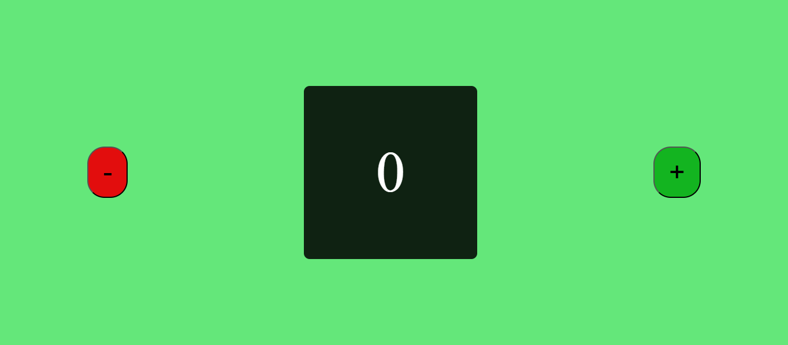

# Counter 

___
**Counter** è una semplice applicazione che permette all'utente di aumentare o diminuire di una unità un valore di default, che è 0.

## Realizzazione
___
L'applicazione è stata realizzata con HTML, CSS e Javascript. 
___
Qui uno screenshot dell'applicazione

___
L'applicazione è completamente gratuita, disponibile online

### Clicca qui per provare l'applicazione [counter](https://bajo905.github.io/counter/)

